# Air Quality Radar
> Console application used for caching and processing data about air pollution in Poland. Uses public government's API to download measurement data from sensors located all over Poland.

## Usage
When you run program from JAR it displays all necessary information about how to run this app properly.

Let's look what will happen when I start the application for the first time:
1. The cache file will be created if none was found under default location:
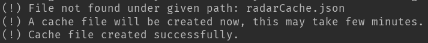
2. No arguments were passed to the program so help will be displayed and program will exit:
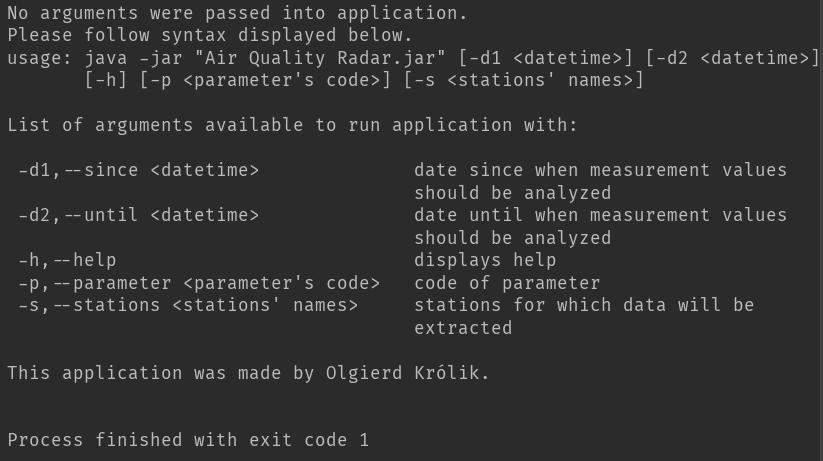

If you already have cache file under default location, the program will read it and decide whether it needs update or not. Default update frequency is set to be 2 hours minimum:
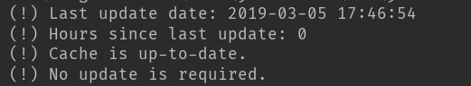

This time let's see what happens when i provide all possible arguments, however not every argument is required.

``
java -jar "./Air Quality Radar.jar" -d1 "2019-03-05 01:00:00" -d2 "2019-03-05 17:00:00" -p "pm10" -s "Warszawa-Komunikacyjna" "Katowice, ul. Plebiscytowa/A4"
``

If you don't provide full configuration you then you can only access functionalities available for passed arguments set.
1. All available options will be displayed and I can provide a number to tell which option I would like to use:
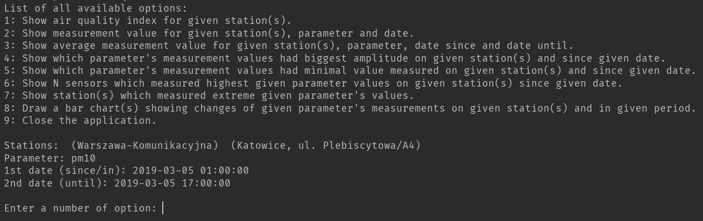
2. Important to notice is that the format of date&time arguments which we pass to the program should be as follows: "yyyy-MM-dd HH:mm:ss" 

## All available options
As you could see, the full configuration allows to use 8 different functionalities. Let's see how every of them works.
1. Show Air Quality Index (AQI) for given station(s).
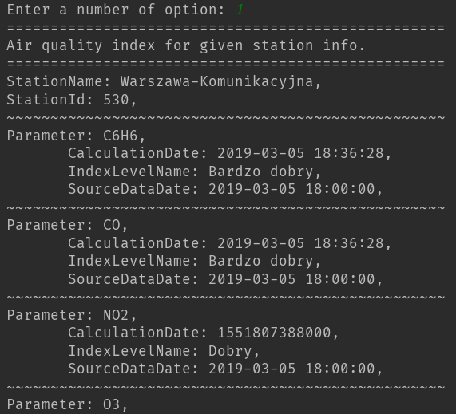
2. Show measurement value for given station(s), parameter and date (d1 argument)
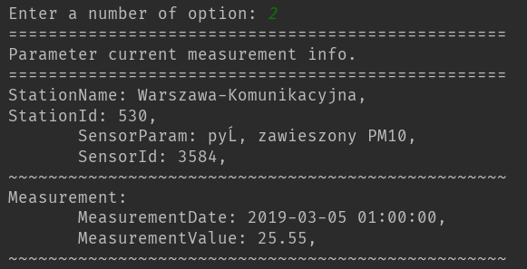
3. Show average measurement value for given station(s), parameter, date since and date until.
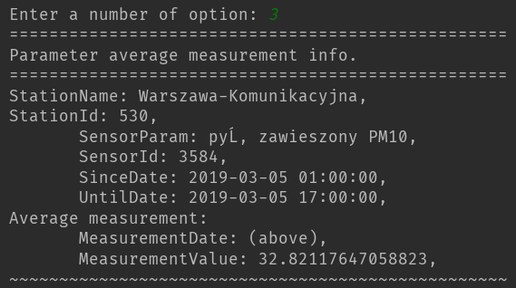
4. Show which parameter's measurement values had biggest amplitude on given station(s) and since given date.
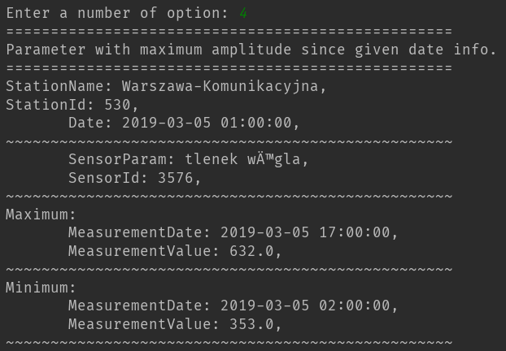
5.Show which parameter's measurement values had minimal value measured on given station(s) and since given date.
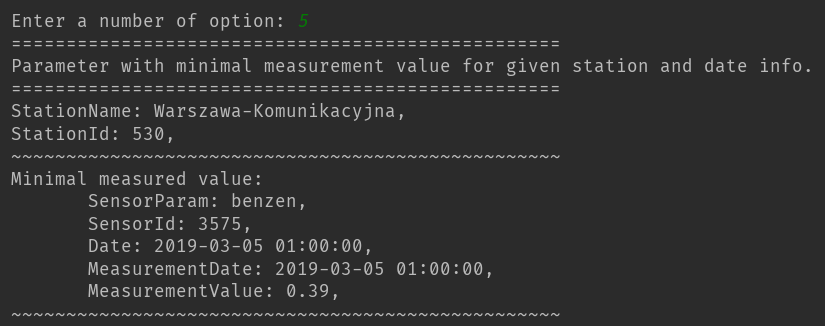
6.Show N sensors which measured highest given parameter values on given station(s) since given date.
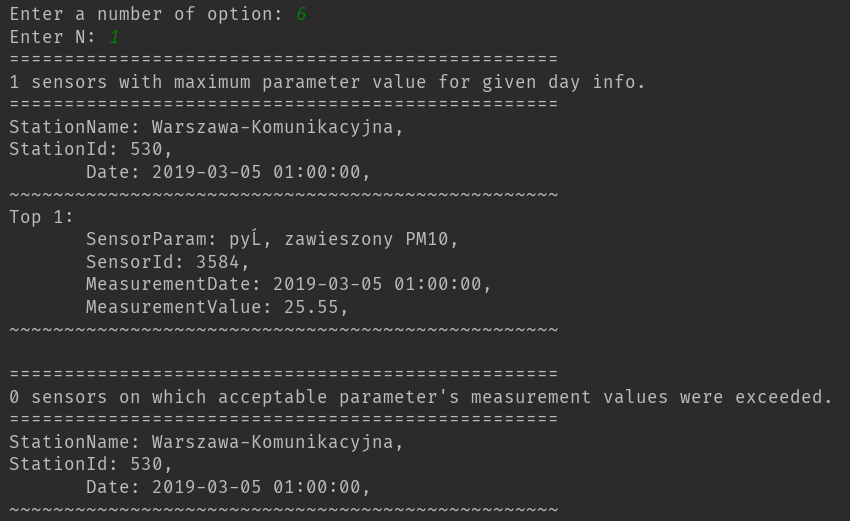
7.Show station(s) which measured extreme given parameter's values.
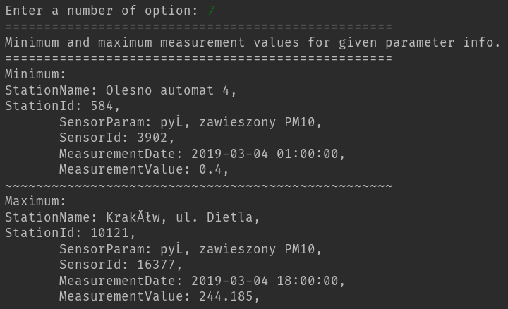
8.Draw a bar chart(s) showing changes of given parameter's measurements on given station(s) and in given period.
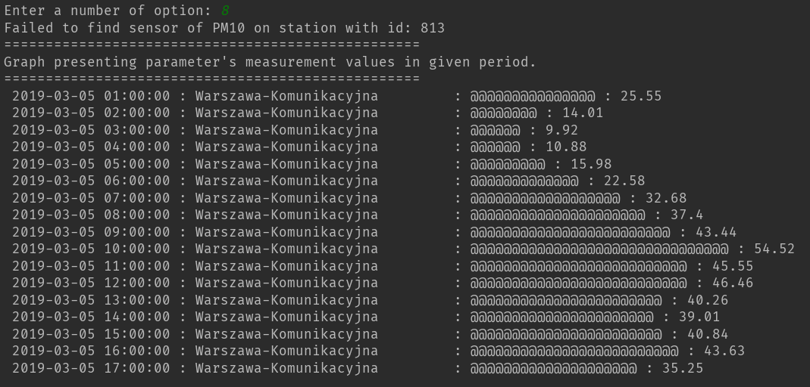

Also there is an option 9. which quits the application loops.

## Errors
Whenever your cached file doesn't contain data which was needed for the option you've chosen, you will be informed by console log starting with '~' sign:
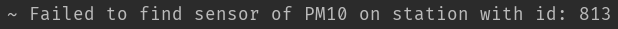

## Airly support feature
* In the source code there are 'empty classes' created to develop this application to support different APIs, i. e. Airly API. This feature might be added in future commits.

## Stuff used
* Java
* Maven
* Mockito, JUnit 4
* Gson
* Apache Commons-CLI library